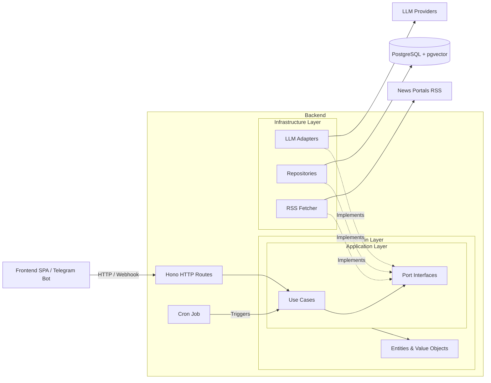

# RuwetMeter - National Sentiment & Anomaly Analysis System

RuwetMeter is an autonomous socio-political stability monitoring system for Indonesia. It continuously scrapes news from major Indonesian portals, analyzes sentiment using LLMs across 4 dimensions (economy, politics, infrastructure, social), and presents the results in a real-time dashboard with anomaly detection and a RAG-powered chatbot.

> **"Ruwet"** - Indonesian slang for chaotic, turbulent, or messy. RuwetMeter measures just how "ruwet" things are.

## Architecture



### Tech Stack

| Layer             | Technology                       | Role                             |
| ----------------- | -------------------------------- | -------------------------------- |
| **Frontend**      | Svelte 5                         | SPA Dashboard & Chat             |
| **Visualization** | Chart.js                         | Time-series line charts          |
| **Backend API**   | Bun + Hono                       | REST API, webhook, cron          |
| **Database**      | PostgreSQL + pgvector            | Metrics, articles, vector search |
| **ORM**           | Drizzle ORM                      | Type-safe SQL + migrations       |
| **LLM**           | 7 providers via Strategy Pattern | Sentiment analysis + chat        |
| **MCP**           | Model Context Protocol           | Standardized LLM tool-use        |

## Key Features

### Automatic Aggregation
- RSS/Atom feeds parsed from **8 major Indonesian news portals**
- Full article extraction via Mozilla Readability
- Scheduled every **3 hours** with PostgreSQL advisory lock (no overlaps)
- Embedding generation with chunked batches (10/batch, 1s delay)
- LLM analysis across 4 dimensions -> scored 0-100

### Visual Dashboard
- Real-time "Ruwet Level" score display with color coding
- 4 dimension bar charts (Economy, Politics, Infrastructure, Social)
- Historical trend line chart (3/7/14/30 day selectors)
- Automated anomaly flagging (delta > 30 from previous cycle)

### RAG Chatbot
- Time-weighted semantic search (24h half-life decay)
- Cosine similarity * exponential decay in SQL
- Single-turn Q&A based on latest news context
- Rate-limited (10 req/min per IP)

### Multi-LLM Architecture
- **7 providers:** Anthropic, OpenAI, Google, OpenRouter, DeepSeek, Mistral, Groq + **OpenCode Zen**
- **Strategy Pattern** - swap providers at runtime via env vars
- OpenAI-compatible adapter for custom endpoints
- Embedding via OpenRouter (OpenAI `text-embedding-3-small` compatible)

### Infrastructure
- Telegram webhook with `X-Telegram-Bot-Api-Secret-Token` validation
- In-memory rate limiter (Map-based)
- Docker Compose for pgvector with auto-init SQL
- Multi-stage Dockerfile for production

## Quick Start

### Prerequisites
- [Bun](https://bun.sh) 1.3+
- [Docker](https://docker.com) + Docker Compose
- An LLM API key (OpenRouter, OpenCode Zen, or any supported provider)

### 1. Start Database
```bash
cd backend
bun run db:up
```

### 2. Configure Environment
```bash
cp .env.example .env
# Edit .env - set API keys and provider preferences
```

### 3. Run Migrations
```bash
bun run db:migrate
```

### 4. Start Backend
```bash
bun run dev
# API at http://localhost:3000/api/v1
```

### 5. Start Frontend
```bash
cd ../frontend
bun install
bun run dev
# UI at http://localhost:5173
```

### 6. Run Aggregation Manually
```bash
cd backend
bun run scripts/run-aggregation.ts
```

## API Endpoints

All endpoints under `/api/v1/`:

| Method | Path                      | Description                                              |
| ------ | ------------------------- | -------------------------------------------------------- |
| `GET`  | `/metrics/current`        | Latest aggregation result with 4-dimension scores        |
| `GET`  | `/metrics/history?days=N` | Historical time-series data for charts                   |
| `GET`  | `/news/anomalies`         | Articles from the latest flagged anomaly cycle           |
| `POST` | `/chat`                   | RAG chatbot (rate-limited, body: `{ "message": "..." }`) |
| `POST` | `/webhook/telegram`       | Telegram bot webhook receiver                            |

Full API contract: [`openapi.yml`](./openapi.yml)

## LLM Providers

RuwetMeter supports 8 providers via the Strategy Pattern. Configure via `.env`:

```env
ANALYSIS_PROVIDER=openrouter    # Which provider for sentiment analysis
CHAT_PROVIDER=openrouter        # Which provider for chatbot
EMBEDDING_PROVIDER=openrouter   # Which provider for embeddings
```

| Provider     | Analysis | Chat | Embeddings | Notes                           |
| ------------ | -------- | ---- | ---------- | ------------------------------- |
| `anthropic`  | Yes      | Yes  | No         | Claude 3.5 Haiku / Sonnet       |
| `openai`     | Yes      | Yes  | Yes        | GPT-4o, text-embedding-3-small  |
| `google`     | Yes      | Yes  | Yes        | Gemini 1.5 Flash/Pro            |
| `openrouter` | Yes      | Yes  | Yes        | OpenAI-compatible proxy         |
| `deepseek`   | Yes      | Yes  | No         | DeepSeek models                 |
| `mistral`    | Yes      | Yes  | No         | Mistral models                  |
| `groq`       | Yes      | Yes  | No         | Groq LPU inference              |
| `opencode`   | Yes      | Yes  | No         | OpenCode Zen (big-pickle, free) |

## Scoring Dimensions

Each dimension scored 0-100 (higher = more turbulent/concerning):

| Dimension          | Scale | Example Triggers                                                    |
| ------------------ | ----- | ------------------------------------------------------------------- |
| **Economy**        | 0-100 | Inflation, unemployment, market crash, subsidy cuts                 |
| **Politics**       | 0-100 | Corruption scandals, protests, leadership crises, election turmoil  |
| **Infrastructure** | 0-100 | Power outages, transportation failures, public service disruptions  |
| **Social**         | 0-100 | Crime spikes, natural disasters, security incidents, mass accidents |

**Total Score** = average of 4 dimensions. **Flagged** if delta > 30 from previous cycle.

## Database

4 tables with pgvector support:

- `news_articles` - 500K+ article capacity with HNSW vector index
- `ruwet_logs` - Time-series aggregation logs with CHECK constraints (0-100)
- `ruwet_log_articles` - Junction table for article-to-log tracking
- Custom ENUM `content_type` (`raw`, `cleaned`, `summary`)

Migrations auto-applied via `drizzle-kit migrate` (pgvector extension enabled automatically).

## RSS Feed Sources

Currently configured (8 feeds):

| Portal                 | Feed URL                                    |
| ---------------------- | ------------------------------------------- |
| Detik News             | `https://news.detik.com/berita/rss`         |
| CNN Indonesia Nasional | `https://www.cnnindonesia.com/nasional/rss` |
| CNBC Indonesia News    | `https://www.cnbcindonesia.com/news/rss`    |
| Tempo Nasional         | `http://rss.tempo.co/nasional`              |
| Liputan6 News          | `https://feed.liputan6.com/rss/news`        |
| ANTARA Top News        | `https://www.antaranews.com/rss/top-news`   |
| SINDOnews              | `https://www.sindonews.com/feed`            |
| Republika Nasional     | `https://www.republika.co.id/rss/nasional/` |

## Testing

```bash
# Unit tests (domain + use cases with mocked ports)
bun test tests/unit/

# Route integration tests (Hono test client)
bun test tests/integration/routes/

# Repository integration tests (testcontainers)
bun test tests/integration/repositories/

# All tests
bun test
```

## Development Commands

```bash
bun run dev              # Start dev server with --watch
bun run typecheck        # TypeScript type check
bun run db:generate      # Generate Drizzle migration from schema
bun run db:migrate       # Apply migrations (auto-enables pgvector)
bun run db:push          # Push schema directly (dev only)
bun run db:up            # Start PostgreSQL via Docker Compose
```

## License

MIT
